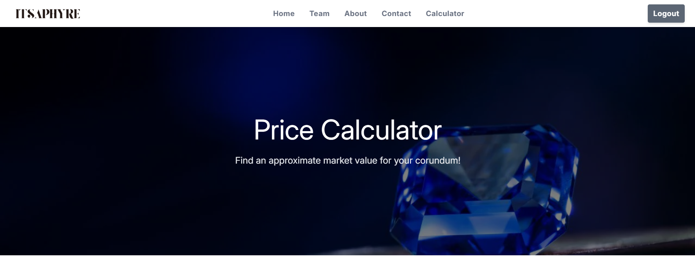
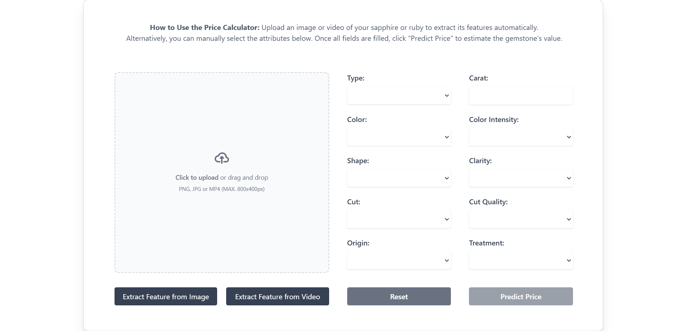

# Itsaphyre 🔮  
*AI-Powered Sapphire Appraisal System*

Itsaphyre is a machine learning-powered web application that provides accurate, data-driven appraisals for sapphires based on uploaded images. Built with the Sri Lankan gem industry in mind, Itsaphyre uses deep learning and statistical modeling to identify key gem characteristics and estimate market value, empowering traders, collectors, and enthusiasts with instant digital evaluations.

---

## 📸 Demo

> **Insert your UI screenshots below**
- Upload Interface  
  

- Appraisal Results Page  
  

---

## ✨ Features

- 📷 Upload sapphire images for instant AI appraisal  
- 🔎 Predicts gem characteristics: clarity, color, cut quality  
- 💰 Provides estimated market value using ML regression  
- 🔐 Secure login & user data handling via Supabase Auth  
- 📚 Appraisal history saved to supabase
- 🌍 Tailored for sapphires native to Sri Lanka and around the world
- 📦 Clean UI/UX for smooth user experience  

---

## 🧠 How It Works

1. **User uploads sapphire image or video** through the web interface  
2. **Image/video is preprocessed** and passed to a trained MobileNetV2 model  
3. **AI model classifies features** like clarity and color  
4. **Regression model estimates value** based on trained market data  
5. **User sees results**, estimated market value available 

---

## 🛠 Tech Stack

### Frontend
- React
- TailwindCSS

### Backend
- Python
- Flask
- TensorFlow / Keras
- Scikit-learn (for regression-based value estimation)

### Storage & Authentication
- Supabase (PostgreSQL)
  - User authentication
  - Storing sapphire details and reports

---

